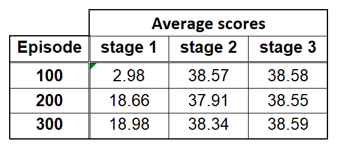

## Introduction
We implemented an Actor-Critic reinforcement learning model based on Deep Deterministic Policy Gradient (DDPG) 
as presented in the repository [Human-level control through deep reinforcement learning](https://web.stanford.edu/class/psych209/Readings/MnihEtAlHassibis15NatureControlDeepRL.pdf) 
with the goal to solve a derivation of the Unity Machine Learning Agents 
([ML-Agents](https://github.com/Unity-Technologies/ml-agents)) [Reacher](https://github.com/Unity-Technologies/ml-agents/blob/master/docs/Learning-Environment-Examples.md#reacher) environment.

## The Environment
The [Reacher](https://github.com/Unity-Technologies/ml-agents/blob/master/docs/Learning-Environment-Examples.md#reacher) 
environment consists of 20 independent double-jointed arms.
The actions are 4 continuous values between [-1, 1], which correspond to toque applied to the two joints.

The state space is continuous and only partially observable. The agent knows about the position, rotation, velocity
and angular velocities of the arm bodies but it doesn't know the specific position of the goal and doesn't have any visual information.

The goal of the agent is to keep the arm in the desired goal area for as long as possible. 
Each step the arm is in the goal location gives a reward of +0.1. The task is episodic (1000 steps per episode) and is considered solved when the
average cummulative reward for all 20 arms is more than 30 over 100 subsequent episodes.

## The Agent
The agent is implemented as a typical Actor-Critic [DDPG](https://arxiv.org/abs/1509.02971) model based on the [Udacity ddpg-pendulum repository](https://github.com/udacity/deep-reinforcement-learning/tree/master/ddpg-pendulum)
which directly computes action values (actor) given the state and tweaks the performance based on estimated state-action value function from critic.
The agent moves through the environment and collects experiences at each step in the form of `(state, action, reward, next_state, done)`.
These experiences are saved to the replay buffer which holds up to `BUFFER_SIZE` most recent experience vectors.
At each `UPDATE_EVERY` steps, the agent samples `BATCH_SIZE` random experiences and performs a gradient descent optimization
with learning rates `LR_ACTOR` and `LR_CRITIC` (using Adam optimizer) based on a mse loss function between local and target networks.

The local network and target network are two sepparate networks with identical architectures. The local network's parameters
 `θ` are the ones being updated through gradient descent while target network serves as a target value estimator, for which
 the parameters `θ'` are softly updated with multiplier `TAU` from the values of `θ`. This allows for smooth improvement of 
 the target value credibility as the agent learns.

The hyperparameters for the final implementation were set as follows:
 ```
BUFFER_SIZE = int(1e5)  # replay buffer size
BATCH_SIZE = 64         # minibatch size
GAMMA = 0.99            # discount factor
TAU = 1e-3              # for soft update of target parameters
LR_ACTOR = 1e-3         # initial learning rate of the actor
LR_CRITIC = 1e-3        # initial learning rate of the critic
WEIGHT_DECAY = 0.0      # L2 weight decay
```

The `LR_ACTOR` and `LR_CRITIC` are the initial learning rates of the actor and critic local network optimizers.
The values were changed during the training to `1e-4` after first 300 episodes and then to `1e-5`
after another 300 episodes of training.

### Network architectures
For Actor-Critic models, there is a total of 4 neural networks which can be grouped as such:
  1. `Actor`
     1. Local
     2. Target
  2. `Critic`
     1. Local
     2. Target
  
In each group the Local and Target networks have identical architectures. 
The final `Actor` architecture implementation consists of the following layer sequence:
  1. `Conv1d` with `8` filters of size `9` and stride `2`
  2. `Conv1d` with `16` filters of size `5` and stride `2`
  3. `Conv1d` with `32` filters of size `3` and stride `1`
  4. `Linear` with `128` hidden units
  5. `Linear` with `64` hidden units
  6. `Linear` with `32` hidden units
  7. `Linear` with `4` hidden units (output layer)
  
Each layer in `Actor` (excluding the output layer) is followed by `BatchNorm1d` layer to stabilize the intermittent layer outputs
and thus hasten the training process.
  
The final `Critic` architecture implementation consists of the following layer sequence:
 1. `Linear` with `400` hidden units
 2. `Linear` with `300` hidden units
 3. `Linear` with `1` hidden unit (output layer)

## Final results
To solve the environment, the agent must be able to achieve average cummulative episode score of +30 for 100 consecutive episodes
over all the 20 arms.
We trained the agent in 3 subsequent stages, each lasting for 300 episodes. In each stage, changes were
made to the learning rates of Actor and Critic (`lrA` and `lrC`) and also maximum number of steps per episode (`tmax`).
The parameters in stages are as follows:
  1. `lrA=1e-3`, `lrC=1e-3`, `tmax=500` (half of regular episode length)
  2. `lrA=1e-4`, `lrC=1e-4`, `tmax=1000` (full regular episode length)
  3. `lrA=1e-5`, `lrC=1e-5`, `tmax=1000`
  
Our agent with hyperparameters and network architectures stated in previous chapters was able to solve the environment
in essentially less than `300` episodes. The achieved score in first 300 episode is halved thanks to tmax being half of the preset number of
steps in one episode. We then trained the subsequent stages two and three to see if lowering the learning rates
allows for consolidation of the parameters and thus improves performance. The picture below shows that the average scores
are staying around `38` with some deviations.


The average scores are also summarized in the following table




## Future improvements
Our agent gives concrete results but is far from achieving state of the art performance.
Several optimizations may be introduced to implement a more stable and performant agent.
For example, the hyperparameters were selected empirically and are by no means considered
optimal for the given task. One might also implement prioritized experience replay to let agent
focus more on important experiences from the replay buffer while ignoring the unimportant ones.
Adding random noise to the trainable parameters of the networks as a regularization technique 
might also bear fruit in the long run of training. We also tried to implement PPO algorithm
to solve the task but the performance was lacking probably due to wrong hyperparameter setting
or a bug in the code. We believe that PPO can be successfully applied to this problem and would
serve as a good comparison to the implemented DDPG method. 
Implementing the Distributed Distributional DDPG (D4PG) also promises better and more stable preformance and
is worth exploring in the future.